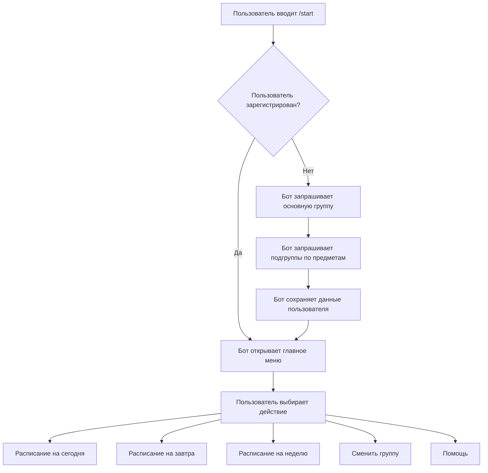
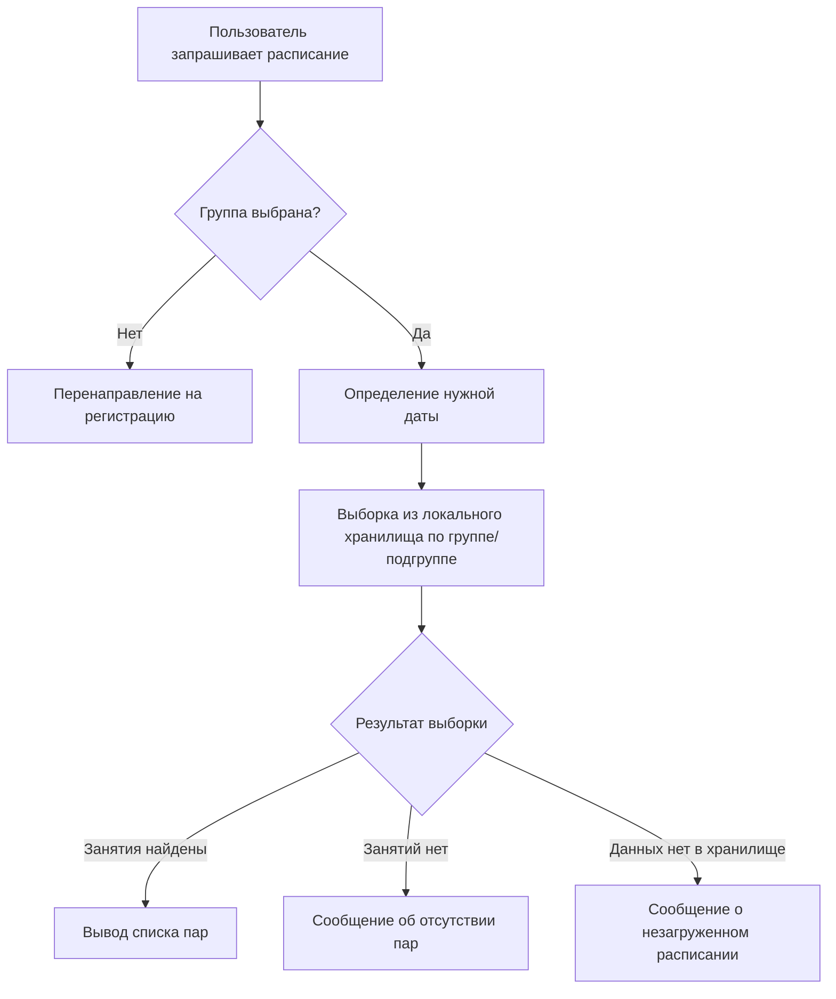

# ЧТЗ: Telegram-бот «Цифровой куратор / Расписание»

---

## 1. Общие сведения

| Параметр | Значение |
|---|---|
| Название проекта | Telegram-бот «Цифровой куратор / Расписание» |
| Версия документа | 0.1 (черновик MVP) |
| Язык разработки | Python 3.10+ |
| Платформа | Telegram Bot API |
| Хранилище данных | JSON / CSV / SQLite (выбор за разработчиком) |

---

## 2. Цель проекта

Разработать Telegram-бота, который предоставляет студентам доступ к актуальному расписанию занятий. В рамках MVP реализуется базовая функциональность: просмотр расписания на сегодня, завтра и текущую неделю, с отображением информации о преподавателе, аудитории и типе занятия.

---

## 3. Область действия

Документ описывает требования к первой версии (MVP) бота. В MVP входят:

- просмотр расписания по выбранной группе;
- отображение данных о каждом занятии (преподаватель, аудитория, корпус, тип занятия);
- базовая навигация через команды и кнопки меню;
- опциональная базовая система уведомлений об изменениях расписания при ручном обновлении данных администратором.

За пределами MVP остаются: автоматическая интеграция с Modeus и другими системами, синхронизация с календарями, напоминания о начале пар, полезные ссылки, дедлайны.

---

## 4. Роли пользователей

| Роль | Описание |
|---|---|
| Пользователь | Студент, взаимодействующий с ботом через Telegram |
| Администратор расписания | Член команды, вручную вносящий и обновляющий данные расписания в локальном хранилище |

---

## 5. Глоссарий

| Термин | Определение |
|---|---|
| Пользователь | Студент, зарегистрированный в боте |
| Администратор расписания | Лицо, ответственное за ручное обновление данных расписания в локальном хранилище |
| MVP | Минимально жизнеспособный продукт — первая рабочая версия бота с базовым набором функций |
| Локальное хранилище | Файл или база данных в формате JSON, CSV или SQLite, хранящая расписание и данные пользователей |
| Группа | Основная учебная группа студента (например, РИ-150943А) |
| Подгруппа | Учебная группа по конкретному предмету, если она отличается от основной (например, ЛБ-04 по физике) |
| Расписание | Структурированный набор записей о занятиях: дата, время, предмет, преподаватель, аудитория, корпус, тип занятия |
| Reply-клавиатура | Постоянные кнопки, отображаемые в Telegram под полем ввода текста |
| Inline-кнопки | Кнопки, прикреплённые непосредственно к конкретному сообщению бота |

---

## 6. Функциональные требования

### FR-1. Команда /start

- **FR-1.1** Бот должен обрабатывать команду `/start`.
- **FR-1.2** При первом запуске бот должен отобразить приветственное сообщение с кратким описанием функций.
- **FR-1.3** Если пользователь не зарегистрирован, бот должен запросить ввод основной учебной группы.
- **FR-1.4** После ввода основной группы бот должен предложить указать подгруппы по предметам, если по некоторым из них группа отличается от основной.
- **FR-1.5** Бот должен сохранить Telegram ID пользователя, его группу и подгруппы в локальном хранилище.
- **FR-1.6** Если пользователь уже зарегистрирован, бот должен пропустить запрос группы и сразу открыть главное меню.
- **FR-1.7** После завершения регистрации бот должен отобразить главное меню.

### FR-2. Команда /help

- **FR-2.1** Бот должен обрабатывать команду `/help` и нажатие кнопки «Помощь».
- **FR-2.2** Бот должен отправить текстовое сообщение со списком доступных команд и коротким описанием каждой.
- **FR-2.3** После сообщения бот должен отобразить (или сохранить) Reply-клавиатуру главного меню.

### FR-3. Главное меню

- **FR-3.1** После регистрации и при каждом обращении к команде `/start` бот должен отображать главное меню через Reply-клавиатуру.
- **FR-3.2** Главное меню должно содержать кнопки: «Расписание на сегодня», «Расписание на завтра», «Расписание на неделю», «Сменить группу», «Помощь».

### FR-4. Расписание на сегодня

- **FR-4.1** Бот должен обрабатывать нажатие кнопки «Расписание на сегодня» и команду `/today`.
- **FR-4.2** Бот должен определить текущую дату и выполнить выборку из локального хранилища по группе/подгруппе пользователя на эту дату.
- **FR-4.3** Если занятия найдены, бот должен вывести их упорядоченным списком по номеру пары. Для каждой пары должны быть указаны: номер пары, время начала и окончания, предмет, тип занятия, ФИО преподавателя, номер аудитории, корпус.
- **FR-4.4** Если на выбранную дату занятий нет, бот должен отправить явное текстовое сообщение об этом.
- **FR-4.5** Если дата отсутствует в локальном хранилище, бот должен сообщить, что расписание на этот период ещё не загружено.
- **FR-4.6** Если пользователь не выбрал группу, бот должен заблокировать выдачу расписания и перенаправить на сценарий регистрации.

### FR-5. Расписание на завтра

- **FR-5.1** Бот должен обрабатывать нажатие кнопки «Расписание на завтра» и команду `/tomorrow`.
- **FR-5.2** Бот должен рассчитать дату следующего дня и выполнить выборку аналогично FR-4.2–FR-4.6.

### FR-6. Расписание на неделю

- **FR-6.1** Бот должен обрабатывать нажатие кнопки «Расписание на неделю» и команду `/week`.
- **FR-6.2** Бот должен определить текущую неделю и выполнить выборку из локального хранилища по группе/подгруппе пользователя на все дни этой недели.
- **FR-6.3** Бот должен отобразить расписание первого учебного дня с занятиями и прикрепить к сообщению inline-кнопки «Назад» и «Вперёд» для навигации по дням.
- **FR-6.4** При нажатии inline-кнопок бот должен обновлять текст сообщения (editMessageText), показывая расписание соответствующего дня, без отправки нового сообщения.
- **FR-6.5** Если на один из дней недели занятий нет — бот должен отобразить сообщение об этом при переходе на этот день.
- **FR-6.6** Если данных на всю неделю нет в хранилище — бот должен сообщить, что расписание не загружено.
- **FR-6.7** Если пользователь не выбрал группу — поведение аналогично FR-4.6.

### FR-7. Сменить группу

- **FR-7.1** Бот должен обрабатывать нажатие кнопки «Сменить группу».
- **FR-7.2** Бот должен запросить новую основную группу и (при необходимости) новые подгруппы по предметам — аналогично FR-1.3–FR-1.5.
- **FR-7.3** После сохранения бот должен отправить подтверждение и вернуть пользователя в главное меню.

### FR-8. Уведомления об изменениях (опционально для MVP)

- **FR-8.1** При наличии технической возможности бот должен поддерживать базовую систему уведомлений об изменениях расписания при ручном обновлении данных администратором.
- **FR-8.2** Скрипт обновления должен сравнивать старую и новую версию расписания и определять затронутые записи.
- **FR-8.3** Бот должен находить пользователей, затронутых изменением (по группе/подгруппе), и отправлять им уведомление с описанием изменения.

> Реализация FR-8 зависит от способа обновления данных администратором. При ручной замене файла без скрипта сравнения уведомления не реализуются.

---

## 7. Нефункциональные требования

- **NFR-1** Бот должен отвечать на пользовательский запрос не дольше чем за 3 секунды при нормальной работе сервера.
- **NFR-2** Токен Telegram-бота не должен храниться в открытом виде в репозитории — только через переменные окружения или `.env`-файл, исключённый из системы контроля версий.
- **NFR-3** Ошибки при чтении данных из локального хранилища должны логироваться.
- **NFR-4** При отсутствии данных или возникновении ошибки бот должен выводить понятное пользователю сообщение, а не завершать работу с необработанным исключением.
- **NFR-5** Бот должен корректно обрабатывать не менее 20 одновременных пользовательских запросов без потери данных.
- **NFR-6** Код должен быть совместим с Python 3.10 и выше.
- **NFR-7** Telegram ID пользователей должен храниться только в локальном хранилище и не передаваться третьим сторонам.

---

## 8. Требования к интерфейсу

### 8.1 Внешние интерфейсы

Бот взаимодействует с пользователем через Telegram Bot API. Для реализации используется библиотека `aiogram` или `python-telegram-bot` (выбор за разработчиком).

### 8.2 Типы клавиатур

| Тип | Где используется |
|---|---|
| Reply-клавиатура | Главное меню — постоянно отображается под полем ввода |
| Inline-кнопки | Навигация по дням в режиме «Расписание на неделю» |

### 8.3 Формат вывода занятия

Каждая пара выводится в следующем формате:

```
1 пара (09:00–10:30)
Матанализ — лекция
Преподаватель: Иванов И.И.
Аудитория 305, корпус Б
```

### 8.4 Состояния ошибок и пустых данных

| Ситуация | Сообщение бота |
|---|---|
| Занятий на дату нет | Явное текстовое сообщение об отсутствии пар |
| Данных на дату нет в хранилище | Сообщение о том, что расписание ещё не добавлено |
| Группа не выбрана | Предложение пройти регистрацию |
| Ошибка чтения хранилища | Сообщение об ошибке, без завершения работы бота |

### 8.5 Миграция данных

В MVP данные расписания вручную переносятся из Modeus или приложения УрФУ в локальное хранилище (JSON, CSV или SQLite). Автоматического импорта нет. Обновление выполняется заменой файла или редактированием базы данных администратором.

---

## 9. Требования к данным

Для каждой записи расписания (одной пары) требуются следующие поля:

| Поле | Тип | Обязательное | Описание |
|---|---|---|---|
| день недели | строка | да | Пн / Вт / Ср / Чт / Пт / Сб / Вс |
| дата | дата | да | Конкретная дата занятия |
| номер пары | целое число | да | Порядковый номер пары в расписании дня |
| время начала | строка | да | чч:мм |
| время окончания | строка | да | чч:мм |
| предмет | строка | да | Название учебной дисциплины |
| преподаватель | строка | да | ФИО преподавателя |
| аудитория | строка | да | Номер кабинета |
| корпус | строка | да | Буква или номер учебного корпуса |
| тип занятия | строка | да | лекция / семинар / практика / лабораторная |
| группа | строка | да | Номер основной учебной группы |
| подгруппа | строка | нет | Заполняется, если по предмету группа отличается от основной |

Дата хранится отдельно от дня недели, так как расписание может отличаться по чётным/нечётным неделям и содержать замены — без даты невозможно однозначно определить, к какой конкретной неделе относится запись.

---

## 10. Сценарии использования

### 10.0 Источник данных

Вся логика сценариев MVP опирается на локальное хранилище, обновляемое администратором вручную. Автоматического парсинга внешних источников на данном этапе нет. Обновление выполняется заменой файлов JSON/CSV или редактированием SQLite-базы.

### 10.1 Сценарий /start

**Вход:** команда `/start`

1. Пользователь отправляет команду `/start`.
2. Бот приветствует пользователя и кратко описывает базовые функции.
3. Если пользователь новый — бот запрашивает ввод основной учебной группы.
4. Бот предлагает указать подгруппы для предметов, где состав группы отличается от основной.
5. Бот сохраняет Telegram ID пользователя, его группу и подгруппы в локальном хранилище.
6. Бот отображает главное меню через Reply-клавиатуру.
7. Если пользователь уже зарегистрирован — бот пропускает шаги 3–5 и сразу открывает главное меню.

**Выход:** отображение главного меню.

---

### 10.2 Сценарий /help

**Вход:** команда `/help` или нажатие кнопки «Помощь»

1. Пользователь вводит `/help` или нажимает кнопку «Помощь».
2. Бот отправляет сообщение со списком всех доступных команд и описанием функций.
3. Reply-клавиатура главного меню остаётся доступной.

**Выход:** текстовое сообщение со справкой.

---

### 10.3 Сценарий «Расписание на сегодня»

**Вход:** нажатие кнопки «Расписание на сегодня» или команда `/today`

1. Бот определяет текущую дату.
2. Бот выполняет выборку из локального хранилища по группе/подгруппе пользователя на эту дату.
3. **Исход А** — занятия найдены: бот выводит список пар, отсортированных по номеру. Для каждой пары указаны: время, предмет, тип занятия, ФИО преподавателя, аудитория и корпус.
4. **Исход Б** — занятий на дату нет (выходной или окно весь день): бот выводит сообщение об отсутствии пар.
5. **Исход В** — дата отсутствует в хранилище: бот сообщает, что расписание на этот период ещё не загружено.
6. **Исход Г** — группа не выбрана: бот перенаправляет на сценарий 10.1.

**Выход:** список пар или текстовое сообщение об отсутствии данных.

---

### 10.4 Сценарий «Расписание на завтра»

**Вход:** нажатие кнопки «Расписание на завтра» или команда `/tomorrow`

1. Бот рассчитывает дату следующего дня.
2. Далее повторяются шаги 2–6 из сценария 10.3.

**Выход:** список пар или текстовое сообщение об отсутствии данных.

---

### 10.5 Сценарий «Расписание на неделю»

**Вход:** нажатие кнопки «Расписание на неделю» или команда `/week`

1. Бот определяет текущую неделю и собирает данные по группе/подгруппе пользователя на все дни.
2. Бот отображает расписание первого учебного дня с занятиями.
3. К сообщению прикрепляются inline-кнопки «Назад» и «Вперёд».
4. При нажатии кнопок бот обновляет текст сообщения (editMessageText), показывая расписание соответствующего дня. Reply-клавиатура главного меню остаётся доступной.
5. Если на один из дней пар нет — при переходе на этот день бот выводит сообщение об отсутствии занятий.
6. Если данных на всю неделю нет в хранилище — бот сообщает, что расписание не загружено.
7. Если группа не выбрана — бот перенаправляет на сценарий 10.1.

**Выход:** интерактивное сообщение с расписанием на день и кнопками навигации.

---

### 10.6 Сценарий «Сменить группу»

**Вход:** нажатие кнопки «Сменить группу»

1. Бот запрашивает новую основную учебную группу.
2. Бот предлагает обновить подгруппы по предметам (аналогично шагам 4–5 сценария 10.1).
3. Бот перезаписывает данные пользователя в хранилище и отправляет подтверждение.
4. Бот возвращает пользователя в главное меню.

**Выход:** подтверждение обновления данных, главное меню.

---

### 10.7 Сценарий «Уведомления об изменениях» (опционально для MVP)

**Вход:** обновление данных расписания администратором

1. Администратор обновляет данные в локальном хранилище.
2. Скрипт обновления сравнивает старую и новую версии расписания.
3. При обнаружении изменений система находит пользователей, затронутых этими изменениями (по группе/подгруппе).
4. Бот отправляет им уведомление с описанием изменения.

Пример уведомления:

```
Внимание, изменение в расписании!
На 14.09 изменён кабинет по предмету Физика.
Новое место: аудитория 204, корпус А.
```

**Выход:** проактивное сообщение пользователям, затронутым изменением.

---

### 10.8 Перспективные сценарии (после MVP)

- **Полезные ссылки:** по нажатию кнопки бот отправляет список ссылок на Modeus, личный кабинет УрФУ и другие университетские сервисы.
- **Напоминания:** бот ежедневно проверяет расписание пользователя и отправляет утреннее напоминание с информацией о первой паре.
- **Синхронизация с календарём:** экспорт расписания в Google Calendar или Apple Calendar.
- **Дедлайны:** уведомления о контрольных мероприятиях, зачётах и экзаменах.

---

## 11. Блок-схемы

### 11.1 Общая логика работы бота



### 11.2 Логика получения расписания



---

## 12. Состав работ MVP

| № | Задача |
|---|---|
| 1 | Создание и регистрация Telegram-бота, настройка окружения |
| 2 | Реализация команды `/start` с логикой регистрации и выбора группы |
| 3 | Реализация команды `/help` |
| 4 | Реализация главного меню (Reply-клавиатура) |
| 5 | Реализация просмотра расписания на сегодня и завтра |
| 6 | Реализация просмотра расписания на неделю с inline-навигацией |
| 7 | Реализация смены группы |
| 8 | Ручное заполнение локального хранилища реальными данными расписания |
| 9 | Реализация обработки ошибок и логирования |
| 10 | Тестирование и устранение замечаний |
| 11 | Реализация базовых уведомлений об изменениях (опционально) |

---

## 13. Порядок приёмки MVP

MVP считается готовым к сдаче при выполнении всех следующих условий:

- [ ] Команда `/start` работает корректно.
- [ ] Пользователь может ввести учебную группу при первом запуске.
- [ ] Бот сохраняет группу пользователя и не запрашивает её повторно при следующем `/start`.
- [ ] Команда `/help` возвращает справку по командам.
- [ ] Бот показывает расписание на сегодня.
- [ ] Бот показывает расписание на завтра.
- [ ] Бот показывает расписание на неделю с пролистыванием по дням.
- [ ] Бот корректно сообщает, если занятий на дату нет.
- [ ] Бот корректно сообщает, если данных в хранилище нет.
- [ ] Главное меню работает через кнопки Reply-клавиатуры.
- [ ] Бот не падает при возникновении ошибок чтения данных.
- [ ] Токен бота не хранится в открытом виде в репозитории.

---

## 14. Ограничения MVP

- Автоматическая интеграция с Modeus и другими системами не реализуется.
- Данные расписания вносятся вручную администратором.
- Отдельный интерфейс администратора для управления расписанием не входит в MVP.
- Уведомления об изменениях реализуются только при наличии технической возможности и только при ручном обновлении данных.
- Синхронизация с внешними календарями, напоминания о начале пар, полезные ссылки и уведомления о дедлайнах в MVP не входят.

---

## 15. Обоснование MVP и развитие проекта

По результатам опроса студентов (24 ответа) функции распределены следующим образом:

### Включено в MVP

| Функция | Доля студентов |
|---|---|
| Просмотр расписания на неделю | 58,3% |
| Просмотр расписания на сегодня | 50% |
| Информация о кабинете | 50% |
| Просмотр расписания на завтра | 41,7% |
| Информация о преподавателе | 41,7% |

Эти функции составляют основной пользовательский сценарий и реализуются в первой версии бота.

Уведомления об изменениях расписания (75% респондентов) также включены в MVP, однако с оговоркой: реализация зависит от наличия технической возможности при ручном обновлении данных администратором.

### Развитие проекта

| Функция | Доля студентов |
|---|---|
| Полезные ссылки на сервисы УрФУ | 33,3% |
| Напоминания о начале занятий | 25% |

Дополнительно по результатам свободных ответов планируются: синхронизация с Google и Apple Calendar, уведомления о контрольных мероприятиях и дедлайнах, объединение основных учебных сервисов в одном месте.

---

## 16. Приложения

**Приложение А.** Анализ результатов опроса студентов — `survey-analysis.md`.

Документ содержит полные результаты опроса (24 ответа), распределение ответов по вопросам и анализ свободных ответов. Использован как основание для выбора функций MVP и расстановки приоритетов в разделе 15 настоящего документа.
